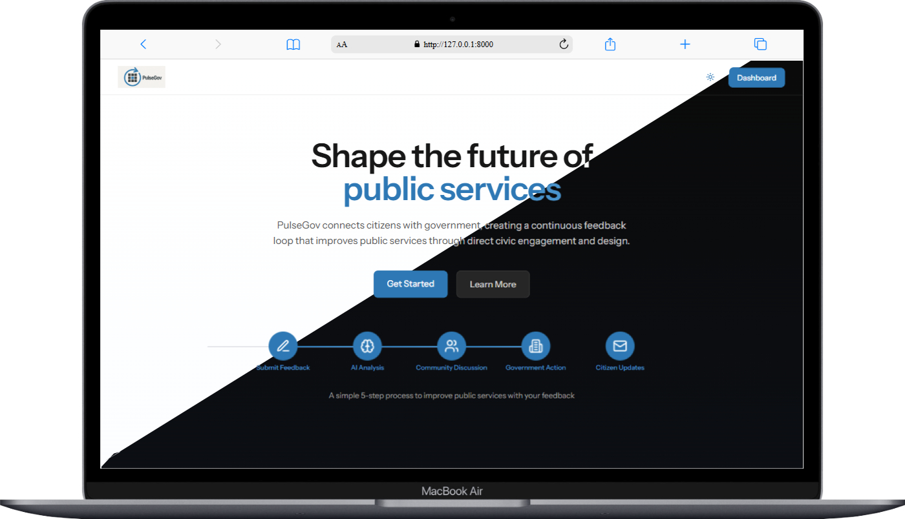
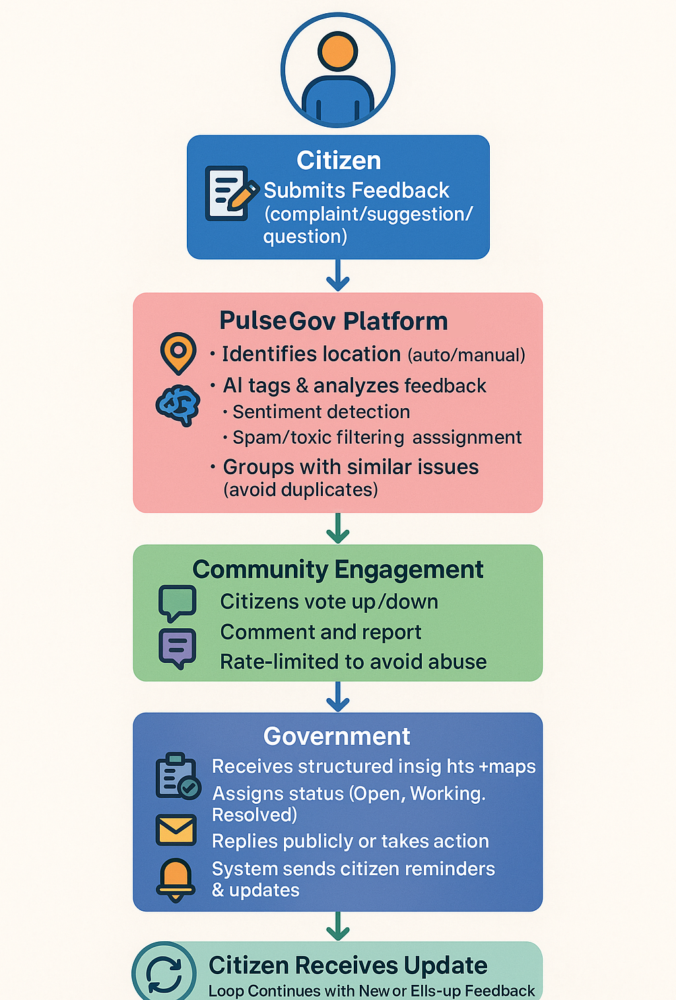
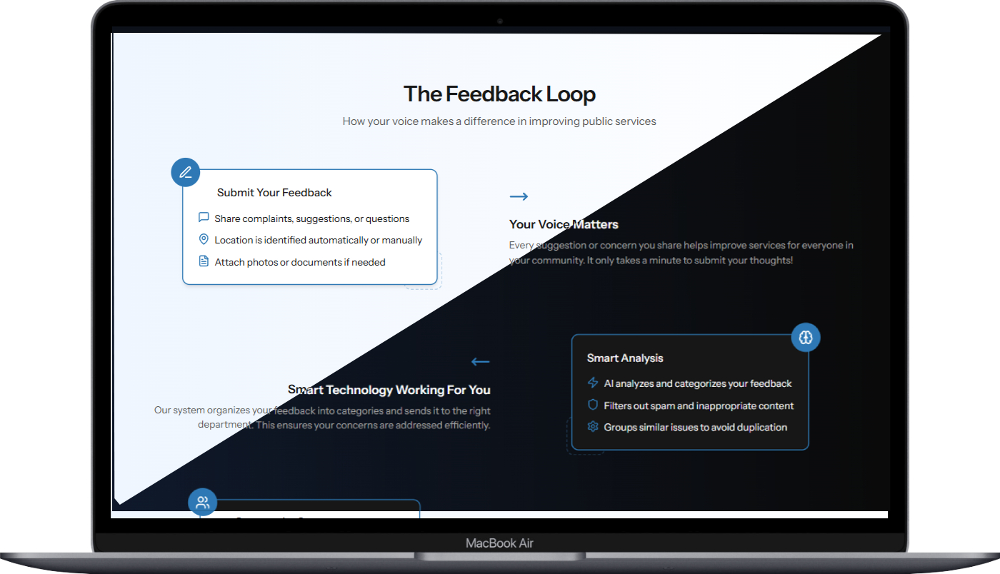
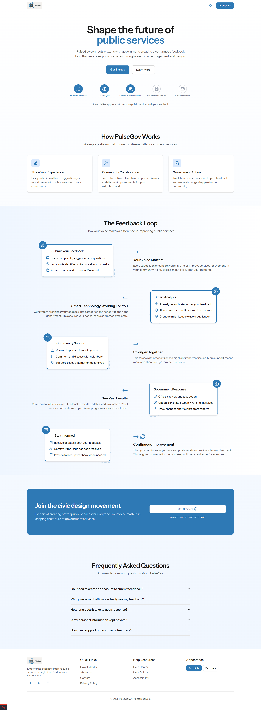
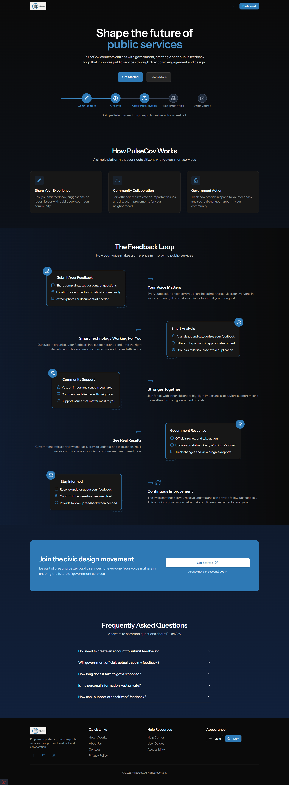
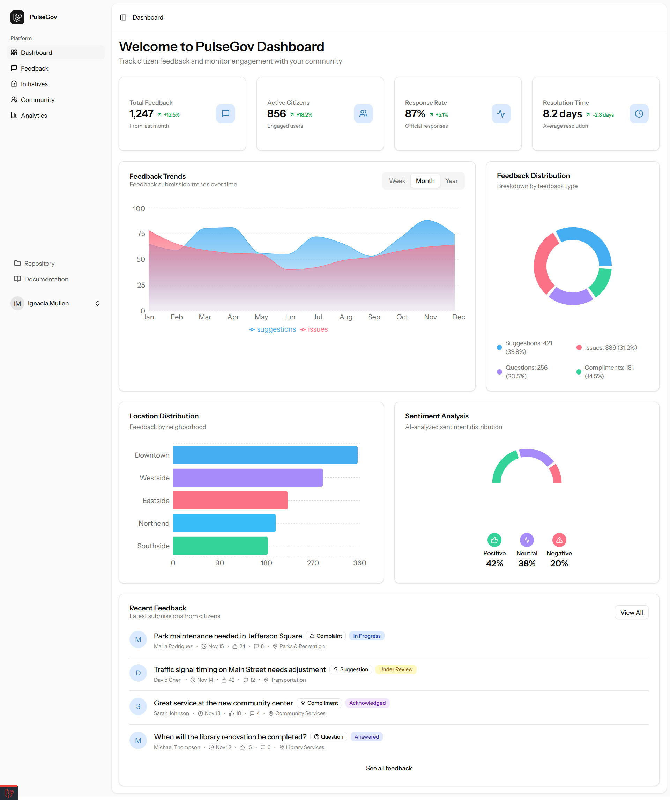
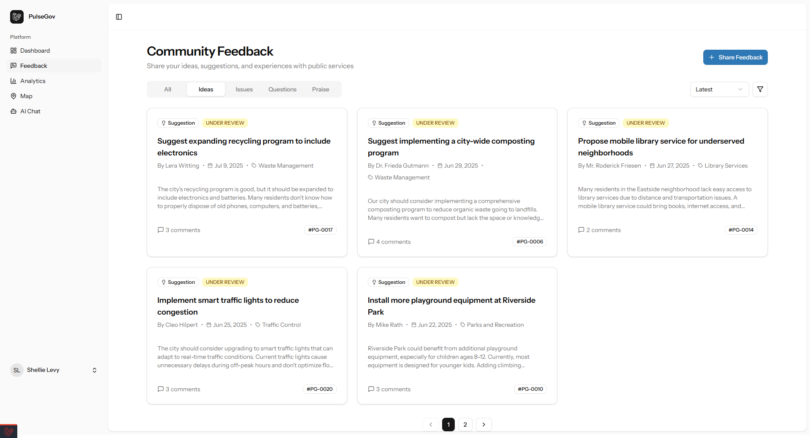
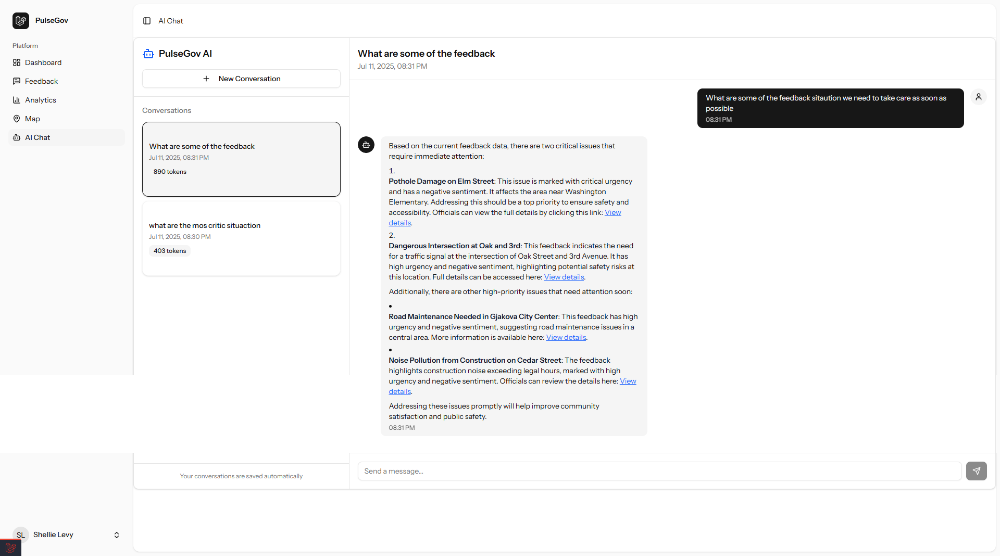
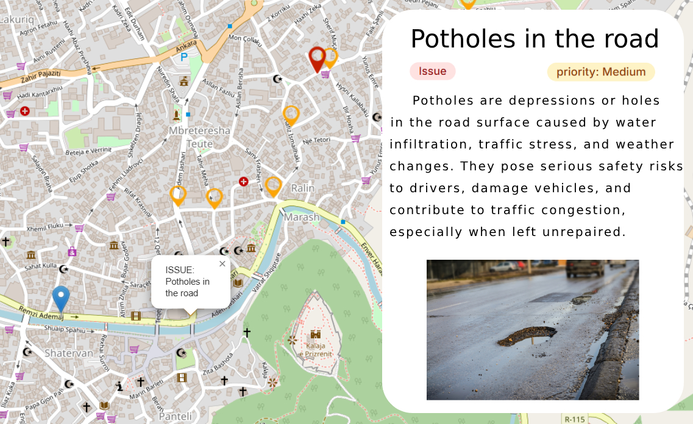

# 🏛️ PulseGov: Smart Civic Feedback & Engagement Platform



**PulseGov** is an AI-powered civic tech platform designed to streamline public feedback, intelligently prioritize municipal issues, and engage only the relevant communities through hyperlocal decision-making and dynamic mapping. Built for transparency, efficiency, and smarter governance.

## 📌 Table of Contents

- [🚀 Features](#-features)
- [🧠 Architecture](#-architecture)
  - [How this works](#how-this-works)
- [🗃️ Data Models](#-data-models)
- [🔄 Civic Referendum System](#-civic-referendum-system)
- [🧠 AI Capabilities](#-ai-capabilities)
- [🗺️ Feedback Map & Population Scaling](#-feedback-map--population-scaling)
- [🧩 Departmental Dataset](#-departmental-dataset)
- [⏱️ Rate Limiting & Abuse Prevention](#️-rate-limiting--abuse-prevention)
- [🛠️ Installation](#️-installation)
- [⚙️ Tech Stack](#️-tech-stack)
- [📸 Screenshots](#-screenshots)

## 🚀 Features

- **AI-Powered Feedback Prioritization** based on season, location, and urgency
- **User-Specific Referendum Links** for hyperlocal decisions
- **Smart Text Analysis** that mimics Reddit’s hot ranking
- **Geospatial Feedback Map** with pin-based issue clustering
- **Spam & Toxicity Detection**
- **Sentiment Analysis & Department Assignment**
- **Duplicate Detection** (StackOverflow-style suggestion system)
- **Threaded Comments & Status Tracking**
- **Population Density Awareness** for scalable impact
- **Structured Departmental Routing System**
- **AI BOT Assistance** for real-time feedback and engagement
- **Nice looking UI**

## 🧠 Architecture

🔄 PulseGov Feedback Lifecycle – How It Works
This process illustrates how a piece of feedback from a citizen travels through the PulseGov system, from submission to resolution and continuous improvement:

### 🧍‍♂️ 1. Citizen Submits Feedback

- A user submits a complaint, suggestion, or question.

- Optional fields: title, photo, and location (can be auto-detected or manually selected).

### 🧠 2. PulseGov Platform Processes the Input

- 📍 Location Identification: Detects the citizen’s location.

- 🧠 AI Analysis:
  - Performs sentiment detection (positive, neutral, negative).
  - Spam and toxicity filtering to prevent abuse.
  - Assigns priority level and routes the issue to the appropriate municipal department.
  - 🔁 Feedback Grouping: Detects and suggests similar feedback to avoid duplication.

### 👥 3. Community Engagement

- Citizens can upvote/downvote the feedback.

- Allows comments and reports for moderation.

- A rate limit ensures each user can only submit up to 3 feedbacks per hour.

### 🏛️ 4. Government Response

- Government dashboards receive structured feedback with maps and analytics.

- Officials assign status: Open, Working, Resolved, or Closed.

- May publicly respond or take direct action.

- The system triggers reminders/updates to citizens.

- A changelog may be added for transparency.

### 📬 5. Citizen is Updated

- Citizens are notified of changes or updates to their feedback.

### 🔁 6. Loop Continues

- The system remains active for follow-up feedback or new submissions, keeping the loop alive and dynamic.

```
[ Citizen ]
     │
     ▼
📝 Submits Feedback (complaint/suggestion/question)
     │
     ▼
[ PulseGov Platform ]
     ├─ 📍 Identifies location (auto/manual)
     ├─ 🧠 AI tags & analyzes feedback
     │     ├─ Sentiment detection
     │     ├─ Spam/toxic filtering
     │     └─ Priority & department assignment
     └─ Groups with similar issues (avoid duplicates)
     │
     ▼
[ Community Engagement ]
     ├─ Citizens vote up/down
     ├─ Comment and report
     └─ Rate-limited to avoid abuse
     │
     ▼
[ Government ]
     ├─ Receives structured insights + maps
     ├─ Assigns status (Open, Working, Resolved)
     ├─ Replies publicly or takes action
     └─ System sends citizen reminders & updates
  └─ Add a Changelog
     │
     ▼
📬 [ Citizen Receives Update ]
     │
     ▼
🔁 Loop Continues with New or Follow-up Feedback

```

### How this works

## 🗃️ Data Models

### Feedback Submission

| Field            | Description                           |
|------------------|---------------------------------------|
| Type             | Suggestion, Complaint, Question       |
| Details          | Full description of the issue         |
| Photos           | Optional media upload                 |
| Title            | Optional short title                  |
| Location         | Auto/manual input                     |

### AI-Enriched Metadata

| Field              | Description                                    |
|--------------------|------------------------------------------------|
| Tags               | Keywords extracted from text                   |
| Spam Detection     | Flag for inappropriate or duplicate content    |
| Priority Type      | High, Medium, Low                              |
| Priority Time      | Estimated time for resolution                  |
| Sentiment          | Negative, Positive, Neutral                    |
| Department         | Assigned based on context                      |
| Recommendation     | Suggested next action                          |
| Total Score        | Composite priority rating                      |

### System Metadata

| Field              | Description                                    |
|--------------------|------------------------------------------------|
| Upvotes / Downvotes| Community voting system                        |
| Comments           | Threaded public discussion                     |
| Reports            | Abuse/inappropriate flagging                   |
| Status             | Open, Working, Resolved, Closed                |
| Reminders          | Follow-up notifications                        |

## 🔄 Civic Referendum System

PulseGov enables **hyperlocal referendums** by generating:

- **User-specific, time-limited links**
- Delivered **only to citizens in affected areas**
- Valid for short durations to ensure relevance
- Ensures decisions are **voted only by those impacted**

## 🧠 AI Capabilities

- **Keyword Learning**: Identifies which complaints are resolved quickly or satisfy citizens.
- **Dynamic Priority Score**: Ranks feedback like Reddit’s “Hot” section.
- **Feedback Grouping**: Suggests similar complaints to avoid duplicates.
- **Language & Toxicity Filters**: Auto-flags harmful feedback.
- **Geographic + Seasonal Prioritization**: Example – higher priority for fire-related issues during summer.

## 🗺️ Feedback Map & Population Scaling

- Each complaint is pinned on a **dynamic map**
- Uses **population density radius** to scale priority
- Helps focus on areas with **greater public impact**

## 🧩 Departmental Dataset

| Field               | Description                                      |
|---------------------|--------------------------------------------------|
| Name                | Department Name                                  |
| Description         | Scope and responsibilities                      |
| Keywords            | Tags for routing relevant feedback               |
| Priority Window     | Season/time of heightened activity               |
| Geographic Relevance| Areas with recurring or critical issues          |

## ⏱️ Rate Limiting & Abuse Prevention

- **Max 3 Feedbacks/User/Hour**
- Spam filtering with user reputation check
- Only **one valid report** is required to flag feedback
- Community moderation for transparency

## 🛠️ Installation

1. Clone the repo:

```bash
git clone https://github.com/alpetgexha/pulsegov.git
cd pulsegov

composer install
npm install && npm run dev

cp .env.example .env

php artisan migrate --seed
php artisan key:generate

composer run dev
```

## ⚙️ Tech Stack

- **Laravel 12** (Backend)
- **React** (Frontend)
- **Tailwind CSS** (Styling)
- **OpenAI** (AI for language/sentiment/keywords)

## 📸 Screenshots

### System Architecture



### UI Overview





### Main Features







PulseGov – Capturing the “pulse” of the people for government services.

PulseGov – Modern and intuitive; reflects real-time citizen sentiment.
